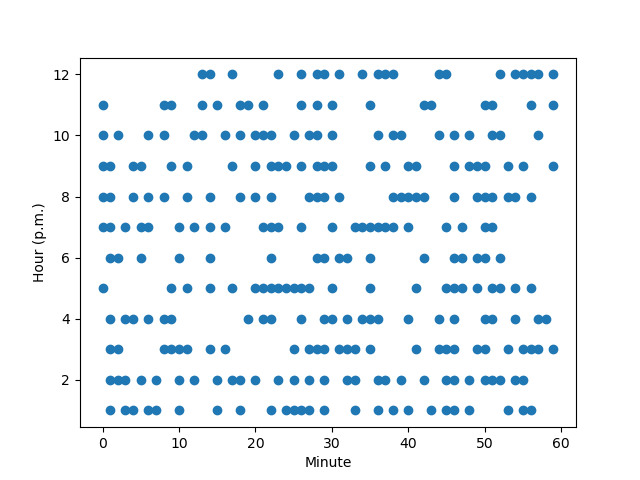

# Factoring the Time

If you do prime factorization of the time, how often do you get the same number of factors in 12-hour format and 24-hour format?

## Answer

Just under 20% of the time.

## Details

Inspired by [this XKCD](https://xkcd.com/247/) comic. In that one, the clock is 2:53 p.m., and Cueball calculates
$253 = 11 \times 23$. When it switches to 24-hour format, he has to factor 14:53, which turns out to be prime. But what
if it was still a semiprime? That would be kind of neat, wouldn't it?

Obviously, we only do this with the p.m. numbers (afternoon/evening), because 10:00 a.m. is always going to have the same
number of prime factors as its 24-hour sibling, 10:00.
